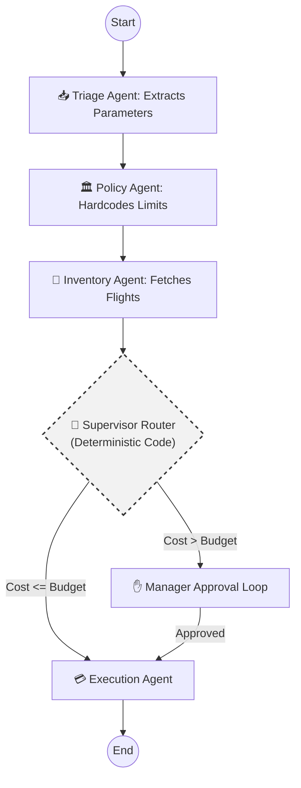
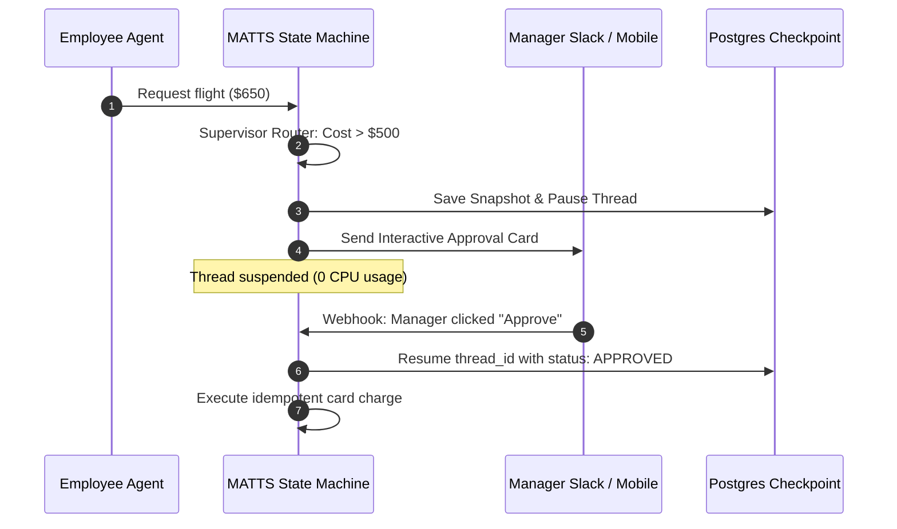
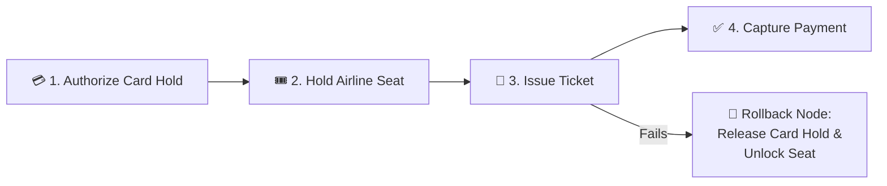

# 🧳 Multi-Agent Tamed Travel System (MATTS)

**LLMs are probabilistic. Corporate budgets are not.** 

Enterprise AI deployments usually fail because agents are chained together non-deterministically—meaning a hallucinating LLM is just one bad prompt away from draining a corporate card. 

**MATTS** is a proof-of-concept architecture that tames multi-agent networks for high-stakes financial environments. Built on `@langchain/langgraph`, it strictly isolates AI agents and forces all execution through a centralized, validated State Object guarded by pure, deterministic code.

---

## 🛡️ The Architecture: Shared State, Isolated Agents

Agents do not communicate directly. They read from and mutate a shared state graph. A deterministic routing function evaluates the state at critical junctures to prevent unauthorized API execution. The shared state graph acts as a centralized **Agentic Data Bus**.




---

## 🛡️ MATTS Risk Mitigation & Failure Mapping

| Failure Mode (Risk) | Hazard Severity | Architectural Mitigation (IE/PM Layer) | Business Outcome |
| :--- | :--- | :--- | :--- |
| **Non-Deterministic Execution (Financial Loss)** | **CRITICAL**<br>*(Agent hallucinates and books a $10k first-class ticket).* | **Supervisor Isolation Gate:** Execution is decoupled from LLM reasoning. A pure deterministic script evaluates `$MAX_BUDGET` against the API cost before allowing a POST request. | **Zero reliance on "prompt engineering" to protect corporate funds.** Hard math acts as the final gate. |
| **Network Timeout & Retry Loops (Double Billing)** | **CRITICAL**<br>*(API drops mid-booking, system retries, credit card charged twice).* | **Pre-Execution Idempotency:** The State Graph generates an `idempotency_key` (`Flight_ID` + `Timestamp`) before touching the Execution Node. | **Guarantees exact-once processing.** Protects the core ledger integrity during transient system outages. |
| **Agentic Deadlock (Infinite Token Burn)** | **HIGH**<br>*(Agents argue over constraints or enter infinite loop trying to fix a bad search).* | **Strict Directed Acyclic Graph (DAG):** Agents are structurally forbidden from conversing. LangGraph enforces a one-way state progression. | **Eliminates runaway cloud inference costs.** If an error occurs, the graph pauses and routes to a human. |
| **Vague Parameter Injection (Garbage In / Garbage Out)** | **MEDIUM**<br>*(User says "Book NY", missing dates and airports, burning downstream API limits).* | **Triage Validation Loop:** The initial LLM node is constrained to a strict JSON schema. If origin, destination, or date are missing, it halts and pings the user. | **Preserves API rate limits (Navan/Expedia)** and ensures downstream agents only receive sanitized, actionable data. |
| **Policy Data Corruption** | **HIGH**<br>*(Inventory agent accidentally overwrites the employee's travel tier in the shared state).* | **Read-Only State Reducers:** The `$MAX_BUDGET` variable is injected by the Policy Node and locked. Downstream agents only have "read" privileges for that parameter. | **Ensures compliance constraints are immutable** once established in the workflow. |

---

## 🌐 API Supply Chain Risk & Vendor Mitigation

### The API Ecosystem
* **Cognitive Layer (External):** LLM Providers (e.g., OpenAI API, Anthropic Claude) handling the non-deterministic Triage and extraction tasks.
* **Inventory Layer (External):** Global Distribution Systems (GDS) or aggregators (e.g., Amadeus, Sabre, Navan API, Expedia Partner Network) fetching live flight routes and pricing.
* **Policy Layer (Internal):** Internal HRIS or employee database endpoints (e.g., Workday API, Company's internal policy DB) determining user tiers and per-diem limits.
* **Execution Layer (Internal):** The core banking ledger and virtual card issuing endpoints executing the final transaction.

### Vendor Risk & Ecosystem Mitigation Matrix

| Vendor / API Risk | Hazard Severity | Architectural Mitigation (IE / PM Layer) | Business Outcome |
| :--- | :--- | :--- | :--- |
| **LLM Provider Outage (OpenAI/Anthropic goes down)** | **HIGH**<br>*(Triage node fails, halting all new requests).* | **Model Agnosticism & Routing:** Implement an abstraction layer (like LiteLLM) to automatically failover from GPT-4o to Claude 3.5 Sonnet if a 502 error or latency spike is detected. | **Guarantees continuous uptime** for the cognitive routing layer without manual engineering intervention. |
| **GDS Rate Limiting (Expedia throttles excessive search API calls)** | **MEDIUM**<br>*(Inventory node fails to fetch flights, disrupting UX).* | **Semantic & TTL Caching:** Cache identical search queries (e.g., "YVR to SFO on Tuesday") in Redis with a 15-minute Time-To-Live. The Inventory Agent checks the cache before hitting the external vendor. | **Drastically reduces third-party API spend** and prevents throttling during high-volume company travel periods. |
| **External API Schema Drift (Navan changes their response JSON structure)** | **HIGH**<br>*(Inventory Agent crashes because it can't parse the new format).* | **Anti-Corruption Layer (ACL):** The Inventory Agent does not ingest raw vendor JSON. It passes the response through an adapter that strictly maps the data to the internal `flightOptions` schema. | **Isolates the Company's internal state machine** from third-party engineering updates. If a vendor breaks, only the adapter needs a patch, not the whole graph. |
| **PII Data Leakage to LLMs (Employee names/IDs sent to OpenAI)** | **CRITICAL**<br>*(Breach of SOC2/Privacy compliance).* | **Data Sanitization Proxy:** The Triage Agent never receives raw employee metadata. The system assigns a temporary UUID (e.g., "User A") and masks sensitive details before the prompt hits the external LLM vendor. | **Maintains strict regulatory compliance** while still leveraging third-party cognitive models for extraction. |

---

## 🚀 The Path to Production Scale: Enterprise Blueprint

To evolve MATTS from an initial prototype to a Tier-1 FinTech production system handling millions in corporate travel spend, the following seven architectural pillars are implemented:

```
┌─────────────────────────┐       ┌─────────────────────────────────────────────────────┐
│    CURRENT PROTOTYPE    │  VS   │                  PRODUCTION SCALE                   │
├─────────────────────────┤       ├─────────────────────────────────────────────────────┤
│ • In-memory state       │       │ • Distributed Durable Checkpointing (PostgreSQL/S3) │
│ • Synchronous approval  │       │ • Asynchronous Asymmetric HITL (Slack/Webhooks)     │
│ • Mocked LLM & GDS APIs │       │ • Structured Output LLMs with Circuit Breakers      │
│ • Single optimistic POST│       │ • Distributed Saga Pattern (Auth → Lock → Capture)  │
│ • Ephemeral console log │       │ • SOX/PCI-DSS Immutable Audit Trails & OpenTelemetry│
└─────────────────────────┘       └─────────────────────────────────────────────────────┘
```

### 1. Distributed Durable State Checkpointing
* **Implementation:** Attach `@langchain/langgraph-checkpoint-postgres` or Redis checkpointers.
* **Resilience:** Workflows can pause for days waiting for human approvals, survive cluster re-deployments, and resume exactly from the last saved state checkpoint using a persistent `thread_id`.

```typescript
import { PostgresSaver } from "@langchain/langgraph-checkpoint-postgres";

const checkpointer = PostgresSaver.fromConnString(process.env.DATABASE_URL!);
await checkpointer.setup();

export const productionMattsApp = workflow.compile({ checkpointer });
```

### 2. Asynchronous Human-in-the-Loop (HITL) via `interrupt()`
* **Implementation:** Replaces synchronous mocks with LangGraph's native `interrupt()` primitive.
* **Flow:** Yields execution, suspends CPU consumption, dispatches an interactive card to the Manager's Slack/Email, and resumes when the approval webhook fires.



### 3. Distributed Financial Saga Pattern (Compensating Actions)
* **Problem:** If a card charge succeeds but airline ticket issuance fails, money is debited without an issued ticket (split-brain state).
* **Mitigation:** Implement a Two-Phase Saga (Authorize Hold $\rightarrow$ Lock Inventory Seat $\rightarrow$ Issue Ticket $\rightarrow$ Capture Charge) with compensating rollback nodes if any step fails.



### 4. Resilient Vendor Boundary (Cognitive Failover & ACL)
* **LLM Cognitive Layer Failover:** Use an abstraction proxy (LiteLLM) routing default traffic to GPT-4o with automatic circuit breaker failover to Claude 3.5 Sonnet during outages.
* **Anti-Corruption Layer (ACL):** Protects the internal state bus from third-party schema drift (Navan / Amadeus / Sabre API breaking changes) by normalizing payload adapters.
* **Semantic Caching:** Redis cache with 15-minute TTL to reduce repetitive vendor GDS query fees and rate-limit exhaustion.

### 5. FinTech Security, RBAC & PCI-DSS Compliance
* **Separation of Duties (SoD):** Enforces cryptographically that the employee initiating a booking cannot self-approve policy overrides.
* **Zero PCI Leakage:** Raw card numbers (PANs) never touch the State Bus or LLM contexts; tokenized payment references (`tok_...`) are used exclusively.
* **WORM Audit Trail:** Immutable append-only write logs for SOX regulatory compliance.

### 6. Observability & Distributed Tracing (OpenTelemetry & LangSmith)
* Track token economics, prompt latency, P95/P99 execution times, and guardrail interception frequencies across all nodes in real time.

---

## 💻 Running MATTS Locally

### Prerequisites
- Node.js 18+
- npm 9+

### Installation
```bash
git clone https://github.com/Amritpd/MATTS.git
cd MATTS
npm install
```

### Available Commands
| Command | Description |
| :--- | :--- |
| `npm start` | Runs the CLI state machine prototype |
| `npm run dev` / `npm run serve` | Launches the **Live Observability Dashboard** at `http://localhost:3000` |
| `npm test` | Runs all 19 Unit, Regression, and Integration tests with Vitest |
| `npm run test:unit` | Runs isolated node handler and router unit tests |
| `npm run test:regression` | Runs FinTech boundary condition and idempotency tests |
| `npm run test:integration` | Runs end-to-end StateGraph lifecycle tests |
