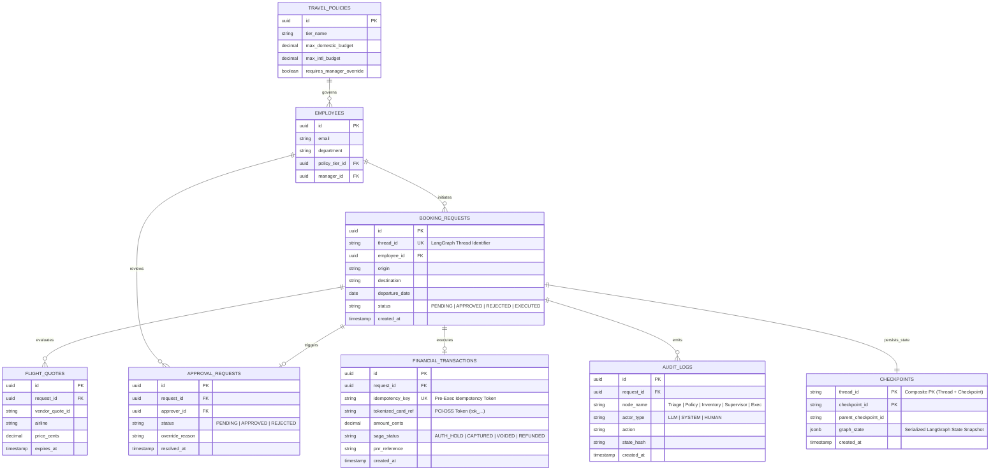
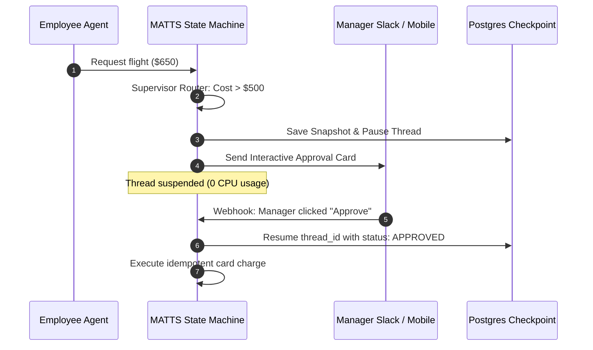
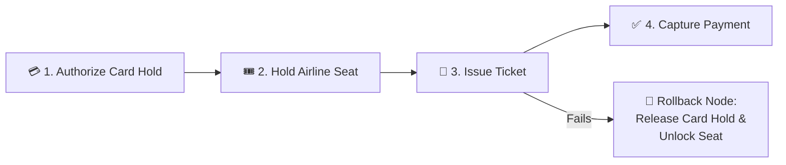

# 🧳 Multi-Agent Tamed Travel System (MATTS)

**LLMs are probabilistic. Corporate budgets are not.** 

Enterprise AI deployments usually fail because agents are chained together non-deterministically and without fully understanding the assumptions of connecting them. This means a hallucinating LLM is just one bad prompt away from draining a corporate card or worse, sending sensitive customer data to the wrong place. 

**MATTS** is a proof-of-concept architecture that *tames* multi-agent networks for high-stakes financial environments. Built on `@langchain/langgraph`, it strictly isolates AI agents and forces all execution through a centralized, validated State Object guarded by pure, deterministic code. **MATTS** is not meant for production use, but rather to provide a higher level but end-to-end overview of building safe multi-agent systems in the context of a business process problem.

---

## 🛡️ The Architecture: Shared State, Isolated Agents

The key difference here is that agents do not communicate directly. Instead, they read from and mutate a *shared state graph*. A deterministic routing function evaluates the state at critical junctures to prevent unauthorized API execution. The shared state graph acts as a centralized **Agentic Data Bus**.


### Prototype Implementation vs. Production Blueprint

| Architectural Component | Working In This Prototype (Code) | Target Production Specification (Design Blueprint) |
| :--- | :--- | :--- |
| **Agent Orchestration** | `@langchain/langgraph` StateGraph | Distributed Worker Mesh + LangGraph Checkpointers |
| **State & Persistence** | In-Memory `TravelStateAnnotation` with immutable reducers | `@langchain/langgraph-checkpoint-postgres` + S3 |
| **Idempotency Model** | Intent-scoped deterministic hash (`INTENT-` + `FL-`) | Distributed Redis Mutex + Postgres Unique Constraint |
| **Policy Guardrails** | Deterministic Supervisor Router + Immutable `$MAX_BUDGET` | Live HRIS Policy Database / Dynamic Tier Matrix |
| **Inventory & Execution** | Mocked GDS & Virtual Card Ledger | Amadeus / Navan GDS + Virtual Card Issuing APIs |
| **Audit & Observability** | Console Telemetry + SSE Live Dashboard | Immutable WORM Logs (SOX/PCI-DSS) + OpenTelemetry |

---

## 🛡️ MATTS Risk Mitigation & Failure Mapping

| Failure Mode (Risk) | Hazard Severity | Architectural Mitigation (IE/PM Layer) | Business Outcome |
| :--- | :--- | :--- | :--- |
| **Non-Deterministic Execution (Financial Loss)** | **CRITICAL**<br>*(Agent hallucinates and books a $10k first-class ticket).* | **Supervisor Isolation Gate:** Execution is decoupled from LLM reasoning. A pure deterministic script evaluates `$MAX_BUDGET` against the API cost before allowing a POST request. Rules-based algorithms gate financial execution with absolute certainty. | **Zero reliance on "prompt engineering" to protect corporate funds.** Hard math acts as the final gate. |
| **Network Timeout & Retry Loops (Double Billing)** | **CRITICAL**<br>*(API drops mid-booking, system retries, credit card charged twice).* | **Intent-Scoped Idempotency:** The State Graph binds an immutable `intentId` to the commercial request. Retries replay the exact same idempotency token, guaranteeing ledger deduplication without re-charging. | **Guarantees exact-once processing.** Protects the core ledger integrity during transient or intermittent system outages. |
| **Agentic Deadlock (Infinite Token Burn)** | **HIGH**<br>*(Agents argue over constraints or enter infinite loop trying to fix a bad search).* | **Strict Directed Acyclic Graph (DAG):** Agents are structurally forbidden from conversing. LangGraph enforces a one-way state progression. This ensures no agent can double back to a previous state or jump to an unrelated state. | **Eliminates runaway cloud inference costs.** If an error occurs, the graph pauses and routes to a human. |
| **Vague Parameter Injection (Garbage In / Garbage Out)** | **MEDIUM**<br>*(User says "Book NY", missing dates and airports, burning downstream API limits).* | **Triage Validation Loop:** The initial LLM node is constrained to a strict JSON schema. If origin, destination, or date are missing, it halts and pings the user. | **Preserves API rate limits (Navan/Expedia)** and ensures downstream agents only receive sanitized, actionable data. |
| **Policy Data Corruption** | **HIGH**<br>*(Inventory agent accidentally overwrites the employee's travel tier in the shared state).* | **Immutable Policy Reducer:** The `$MAX_BUDGET` parameter is injected by the Policy Node and locked by a pure reducer. Downstream nodes cannot overwrite or elevate the spending cap. | **Ensures compliance constraints are immutable** once established in the workflow. |


---

## 🌐 API Supply Chain Risk

### The API Ecosystem
* **Cognitive Layer (External):** LLM Providers (e.g., OpenAI API, Anthropic Claude) handling the non-deterministic Triage and extraction tasks.
* **Inventory Layer (External):** Global Distribution Systems (GDS) or aggregators (e.g., Amadeus, Sabre, Navan API, Expedia Partner Network) fetching live flight routes and pricing.
* **Policy Layer (Internal):** Internal HRIS or employee database endpoints (e.g., Workday API, Company's internal policy DB) determining user tiers and per-diem limits.
* **Execution Layer (Internal):** The core banking ledger and virtual card issuing endpoints executing the final transaction.

### Vendor Risk & Ecosystem Mitigation Matrix

| Vendor / API Risk | Hazard Severity | Architectural Mitigation (IE / PM Layer) | Business Outcome |
| :--- | :--- | :--- | :--- |
| **LLM Provider Outage (OpenAI/Anthropic goes down)** | **HIGH**<br>*(Triage node fails, halting all new requests).* | **Model Agnosticism & Routing:** Implement an abstraction layer (like LiteLLM) to automatically failover from GPT-4o to Claude 3.5 Sonnet to other subsequent models if a 502 error or latency spike is detected. | **Guarantees continuous uptime** for the cognitive routing layer without manual engineering intervention. |
| **GDS Rate Limiting (Expedia throttles excessive search API calls)** | **MEDIUM**<br>*(Inventory node fails to fetch flights, disrupting UX).* | **Semantic & TTL Caching:** Cache identical search queries (e.g., "YVR to SFO on Tuesday") in Redis with a 15-minute Time-To-Live. The Inventory Agent checks the cache before hitting the external vendor. | **Drastically reduces third-party API spend** and prevents throttling during high-volume travel periods. |
| **External API Schema Drift (Navan changes their response JSON structure)** | **HIGH**<br>*(Inventory Agent crashes because it can't parse the new format).* | **Anti-Corruption Layer (ACL):** The Inventory Agent does not ingest raw vendor JSON. It passes the response through an adapter that strictly maps the data to the internal `flightOptions` schema. | **Isolates the Company's internal state machine** from third-party engineering updates. If a vendor breaks, only the adapter needs a patch, not the whole graph. |
| **PII Data Leakage to LLMs (Employee names/IDs sent to OpenAI)** | **CRITICAL**<br>*(Breach of SOC2/Privacy compliance).* | **Data Sanitization Proxy:** The Triage Agent never receives raw employee metadata. The system assigns a temporary UUID (e.g., "User A") and masks sensitive details before the prompt hits the external LLM vendor. | **Maintains strict regulatory compliance** while still leveraging third-party cognitive models for extraction. |

---

## 🚀 The Path to Production Scale: Enterprise Blueprint

To evolve MATTS from an initial prototype to a Tier-1 FinTech production system handling hundreds of thousand travel processes per year, the following seven architectural pillars are required:

```
┌─────────────────────────┐       ┌─────────────────────────────────────────────────────┐
│    CURRENT PROTOTYPE    │  VS   │                  PRODUCTION SCALE                   │
├─────────────────────────┤       ├─────────────────────────────────────────────────────┤
│ • In-memory state       │       │ • Distributed Durable Checkpointing (PostgreSQL/S3) │
│ • Synchronous approval  │       │ • Asynchronous Asymmetric HITL (Slack/Webhooks)     │
│ • Mocked LLM & GDS APIs │       │ • Structured Output LLMs with Circuit Breakers      │
│ • Single optimistic POST│       │ • Distributed Saga Pattern (Auth → Lock → Capture)  │
│ • Ephemeral console log │       │ • SOX/PCI-DSS Immutable Audit Trails & OpenTelemetry│
└─────────────────────────┘       └─────────────────────────────────────────────────────┘
```

### 1. Database Architecture: Prototype vs. Proposed Production Scale

A critical requirement for evolving from an agentic proof-of-concept to a FinTech production system is transitioning from ephemeral in-memory state to a resilient, dual-tier relational and event-checkpointed data architecture.

#### Architectural Comparison

```
┌──────────────────────────────────────────────────┐       ┌─────────────────────────────────────────────────────────────┐
│             PROTOTYPE DATA MODEL                 │  VS   │                  PRODUCTION DATA ARCHITECTURE               │
├──────────────────────────────────────────────────┤       ├─────────────────────────────────────────────────────────────┤
│ • Ephemeral single JavaScript object             │       │ • Dual-tier: LangGraph State Store + ACID Domain DB         │
│ • In-memory process lifespan (lost on crash)     │       │ • Durable PostgreSQL Checkpointing (survives restarts)     │
│ • No relational constraints or foreign keys      │       │ • Strict relational schema, foreign keys & unique keys      │
│ • No concurrency control or distributed locking  │       │ • Redis distributed mutexes & idempotency constraints       │
│ • Non-compliant console logs (No SOX/PCI audit)  │       │ • Append-only WORM audit log & PCI tokenized references     │
└──────────────────────────────────────────────────┘       └─────────────────────────────────────────────────────────────┘
```

---

#### Prototype Database Design (In-Memory State Object)

In the current prototype, state is managed entirely in volatile process memory through the `TravelStateType` schema:

```typescript
// Prototype: In-memory ephemeral interface (src/types.ts)
export interface TravelStateType {
  userInput: string;
  parsedRequest: ParsedRequest;
  maxBudget: number;
  flightOptions: FlightOption[];
  approvalStatus: string;
  finalBookingId: string | null;
}
```

* **Strengths:** Zero infrastructure overhead, zero network latency, instant feedback for unit testing.
* **Limitations:** A container restart mid-workflow drops the booking state, concurrent user requests risk race conditions, and no persistent record exists for accounting reconciliation or compliance audits.

---

#### Proposed Production Database Design (Dual-Tier Architecture)

In production, data is divided into two distinct tiers:
1. **LangGraph State Checkpoint Store (`checkpoints`):** Stores serialized state snapshots per node transition, enabling multi-day asynchronous pause/resume for human approvals (`interrupt()`) and step-level rollback.
2. **Relational Core Domain Ledger (PostgreSQL):** Enforces relational integrity, separation of duties, idempotency guarantees, and immutable compliance auditing.



---

#### Key Structural Differences

| Dimension | Prototype (In-Memory) | Production Scale (Dual-Tier Relational) |
| :--- | :--- | :--- |
| **State Persistence** | Ephemeral Node.js RAM (cleared on exit) | Managed PostgreSQL checkpointer (`@langchain/langgraph-checkpoint-postgres`) |
| **Human-in-the-Loop Suspension** | Synchronous prompt simulation | Durable thread suspension (`thread_id`) surviving cluster reboots |
| **Idempotency & Concurrency** | In-memory token string | Unique DB constraint on `idempotency_key` + Redis distributed locks |
| **Financial Auditing** | Ephemeral console output | Immutable append-only `AUDIT_LOGS` table (SOX/PCI-DSS compliant) |
| **Query Caching** | None (Every search hits mock inventory) | Redis Semantic Cache (15-min TTL) for frequent origin/destination pairs |

---

### 2. Asynchronous Human-in-the-Loop (HITL) via `interrupt()`
* **Implementation:** Replaces synchronous mocks with LangGraph's native `interrupt()` primitive.
* **Flow:** Yields execution, suspends CPU consumption, dispatches an interactive card to the Manager's Slack/Email, and resumes when the approval webhook fires.



### 3. Distributed Financial Saga Pattern (Compensating Actions)
* **Problem:** If a card charge succeeds but airline ticket issuance fails, money is debited without an issued ticket (split-brain state).
* **Mitigation:** Implement a Two-Phase Saga (Authorize Hold $\rightarrow$ Lock Inventory Seat $\rightarrow$ Issue Ticket $\rightarrow$ Capture Charge) with compensating rollback nodes if any step fails.



### 4. Resilient Vendor Boundary (Cognitive Failover & ACL)
* **LLM Cognitive Layer Failover:** Use an abstraction proxy (LiteLLM) routing default traffic to GPT-4o with automatic circuit breaker failover to Claude 3.5 Sonnet during outages.
* **Anti-Corruption Layer (ACL):** Protects the internal state bus from third-party schema drift (Navan / Amadeus / Sabre API breaking changes) by normalizing payload adapters.
* **Semantic Caching:** Redis cache with 15-minute TTL to reduce repetitive vendor GDS query fees and rate-limit exhaustion.

### 5. FinTech Security, RBAC & PCI-DSS Compliance
* **Separation of Duties (SoD):** Enforces cryptographically that the employee initiating a booking cannot self-approve policy overrides.
* **Zero PCI Leakage:** Raw card numbers (PANs) never touch the State Bus or LLM contexts; tokenized payment references (`tok_...`) are used exclusively.
* **WORM Audit Trail:** Immutable append-only write logs for SOX regulatory compliance.

### 6. Observability & Distributed Tracing (OpenTelemetry & LangSmith)
* Track token economics, prompt latency, P95/P99 execution times, and guardrail interception frequencies across all nodes in real time.

---

## 💰 Financial Implications & Total Cost of Ownership (TCO)

Deploying autonomous agentic infrastructure within enterprise financial workflows alters cost structures from fixed labor overhead to variable API and inference economics. Below is a comprehensive breakdown of the operational expenditures (OpEx), risk-adjusted ROI, and unit economics of operating MATTS at scale.

### 1. Cost Breakdown: What Powers the System (OpEx)

```
┌─────────────────────────────────────────────────────────────────────────────────┐
│                           OPERATIONAL COST STRUCTURE                            │
├─────────────────────────┬─────────────────────────┬─────────────────────────────┤
│   COGNITIVE INFERENCE   │    GDS / VENDOR APIS    │   INFRASTRUCTURE & STATE    │
│  • LLM Prompt & Output  │  • Look-to-Book Fees    │  • PostgreSQL Checkpointing │
│  • Token Normalization  │  • Search Query Quotas  │  • Redis Semantic Caching   │
│  • Fallback Routing     │  • Partner Network Tier │  • OpenTelemetry Ingestion  │
└─────────────────────────┴─────────────────────────┴─────────────────────────────┘
```

* **Cognitive Inference Economics (LLM Tokens):**
  * **Triage & Extraction:** Each booking request consumes $\sim$300–800 input tokens and $\sim$150 output tokens for parameter extraction and schema validation.
  * **Optimization with Tiered Models:** By delegating parameter extraction to lightweight, high-throughput models (e.g., GPT-4o-mini or Claude 3.5 Haiku) and reserving frontier reasoning models for complex policy edge cases, inference spend is capped at **$\approx$\$0.002–\$0.008 per execution cycle**.
  * **Semantic Caching ROI:** Up to 35% of employee queries during company-wide events (e.g., all-hands) share identical routes and dates. Redis-based semantic query caching bypasses redundant LLM and GDS calls entirely.
* **GDS & Travel Inventory API Costs (Look-to-Book Economics):**
  * Traditional Global Distribution Systems (Amadeus, Sabre) and travel aggregators charge per API query or penalize poor *Look-to-Book (L2B)* ratios.
  * **MATTS Mitigation:** Parameter validation at the Triage gate ensures external search queries are only executed when essential criteria (origin, destination, date window) are complete, eliminating wasted API call charges from malformed inputs.
* **State & Persistence Infrastructure:**
  * Low-footprint serverless/container nodes hosting LangGraph compiled graphs alongside managed PostgreSQL checkpointers for durable execution state. Infrastructure costs scale sub-linearly with transaction volume.

---

### 2. Downside Protection: Catastrophic Financial Risk Mitigation

The true financial justification for MATTS lies in **tail-risk elimination**. In unconstrained agent architectures, probabilistic failures directly impact corporate balance sheets:

| Financial Risk Vector | Unconstrained Agent Exposure | MATTS Deterministic Guardrail | Financial Impact Avoided |
| :--- | :--- | :--- | :--- |
| **Runaway Agentic Loops** | Agents in conversational loops can generate thousands of LLM calls in minutes ($50–$300+ per stuck thread). | Strict DAG topology with max step bounds halts execution immediately on cycle detection. | **100% elimination of runaway token billing spikes.** |
| **Hallucinated Spending** | An LLM approving a $12,000 first-class booking based on prompt misinterpretation. | Deterministic Supervisor evaluates raw numbers against `$MAX_BUDGET` using pure boolean logic. | **Zero unauthorized corporate credit card charges.** |
| **Split-Brain Double Billing** | Network drops during travel API POST requests triggering uncoordinated retries. | Pre-execution idempotency keys and two-phase distributed financial sagas. | **Zero duplicate ticketing debits and chargeback dispute fees.** |
| **Regulatory & PCI Penalties** | Exposing raw PANs/cardholder data to LLM logs violates PCI-DSS/SOX (penalties up to $100k/month). | Strict tokenization (`tok_...`) ensures raw financial identifiers never enter LLM context windows. | **Guarantees compliance audit pass rates and shields against regulatory fines.** |

---

### 3. Unit Economics Comparison

| Metric | Traditional Travel Desk (Manual) | Naive Multi-Agent System | MATTS Tamed Architecture |
| :--- | :--- | :--- | :--- |
| **Cost per Booking Interaction** | $15.00 – $35.00 *(Human labor / agent fees)* | $1.20 – $8.00+ *(Unbounded token churn & retries)* | **$0.03 – $0.12** *(Optimized tokens + cached GDS)* |
| **Turnaround Latency** | 4 – 48 hours *(Email chains & manual approvals)* | 10 – 60 seconds *(High variance, risk of loop)* | **< 3 seconds** *(Immediate approval or instant HITL card)* |
| **Policy Violation Leakage** | 3% – 7% *(Human oversight / manual errors)* | 5% – 15% *(Prompt injection / hallucination)* | **0.0%** *(Enforced by deterministic code gates)* |
| **Cost-to-Serve Scalability** | Linear ($O(N)$ with headcount growth) | High & unpredictable (Token volatility) | **Sub-linear ($O(\log N)$ via caching & DAG routing)** |

---

### 4. Executive ROI Summary

```
                       Traditional Model          MATTS Architecture
Processing Cost:       [████████████████████] $25.00   [█] $0.08
Policy Breach Risk:    [█████] 5.0%                    [] 0.0%
Resolution Time:       [████████████████████] 24 hrs   [█] 3 secs
```

By substituting expensive human ticketing queues and unpredictable open-ended LLM loops with a deterministic, state-guarded pipeline, MATTS delivers an estimated **95%+ reduction in operational transaction overhead** while completely insulating the company from probabilistic financial loss.

---

## 💻 Running MATTS Locally

### Prerequisites
- Node.js 18+
- npm 9+

### Installation
```bash
git clone https://github.com/Amritpd/MATTS.git
cd MATTS
npm install
```

### Available Commands
| Command | Description |
| :--- | :--- |
| `npm start` | Runs the CLI state machine prototype |
| `npm run dev` / `npm run serve` | Launches the **Live Observability Dashboard** at `http://localhost:3000` |
| `npm test` | Runs all 19 Unit, Regression, and Integration tests with Vitest |
| `npm run test:unit` | Runs isolated node handler and router unit tests |
| `npm run test:regression` | Runs FinTech boundary condition and idempotency tests |
| `npm run test:integration` | Runs end-to-end StateGraph lifecycle tests |
